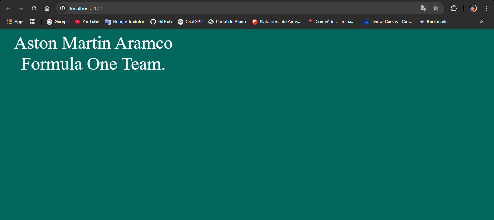
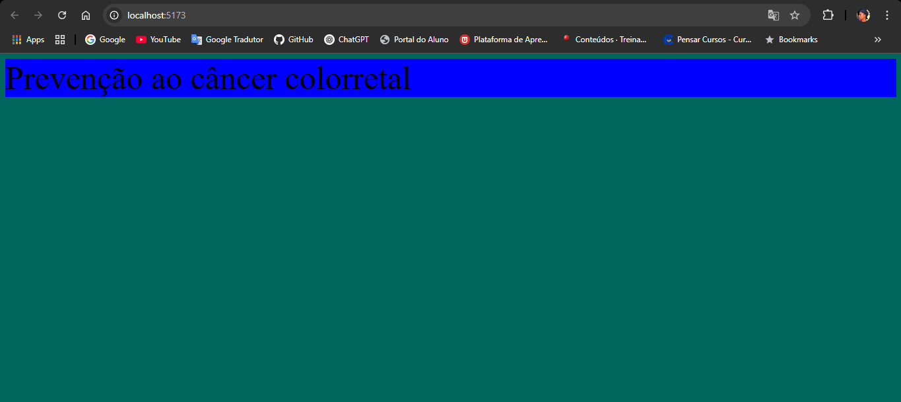

# Exercício aula 4

## Objetivo

O objetivo deste exercício é o desenvolvimento de três componentes, que desta vez, cada componente conterá um CSS Global para estilização das renderizações no Browser, conforme instruções específicas para cada componente.

## Instruções

**Exercicio1**:
- Criar um estilo CSS Global para estilização do Componente.
- Implementar ao CSS Global uma cor de fundo, tamanho de fonte padrão 50px, e uma borda sólida de 3px para as imagens.
- Desenvolver um Componente intitulado "Exercicio1", que renderize um parágrafo "< p >" e uma imagem, para comprovar o efeito do CSS Global.

**Exercicio2**:
- Desenvolver um Componente intitulado "Exercicio2".
- Implementar ao Componenete um estilo Inline usando CSS.
- Incrementar ao estilo o seguinte: uma cor para o texto, uma cor para o fundo, largura de 500px, e alinhamento centralizado para o texto.

**Campanha**:
- Desenvolver um Componente intitulado "Campanha", e para este Componente, desenvolver um CSS Modularizado.
- No Browser, o Componente deve renderizar uma mensagem de acordo com o mês, mensagem esta que deve ser exibida na cor preta.
- A cor de fundo de uma tarja, que pode ser uma "< div >", e a mensagem que compõe a tarja em questão, deve alterar de acordo com o mês que passamos como Prop para o Componente Filho.
- Para o mês de Janeiro, a cor deve ser roxo e renderizar a seguite mensagem: Prevenção e tratamento a hanseníase.
- Para o mês de Outubro, a cor deve ser laranja e renderizar a seguinte mensagem: Sensibilização sobre a leucemia.
- Para o mês de Novembro, a cor deve ser azul e renderizar a seguinte mensagem: Prevenção ao câncer colorretal.

## Resultado no Navegador

**Exercicio1**:

**Exercicio2**:

**Campanha**:

- Janeiro

- Fevereiro

- Março

## Tecnologias Utilizadas

- Visual Studio Code.
- Node.js.
- NPM.
- Vite.
- React.
- JavaScript.